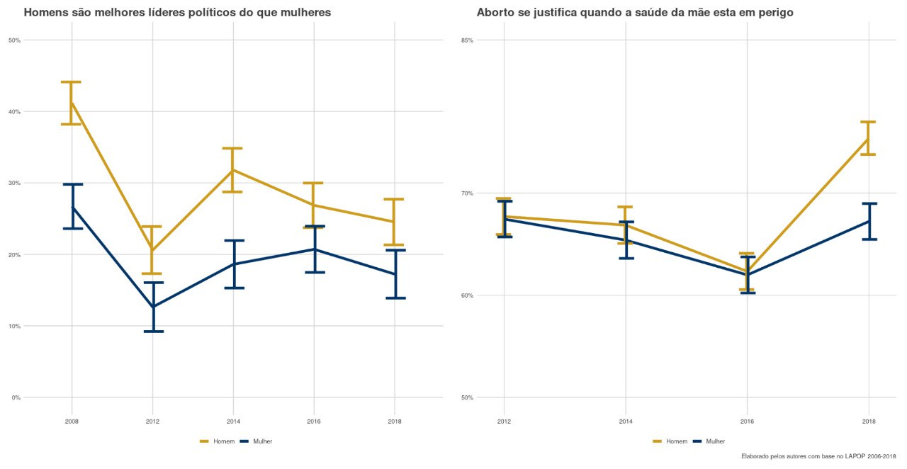
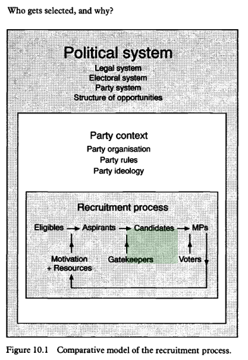
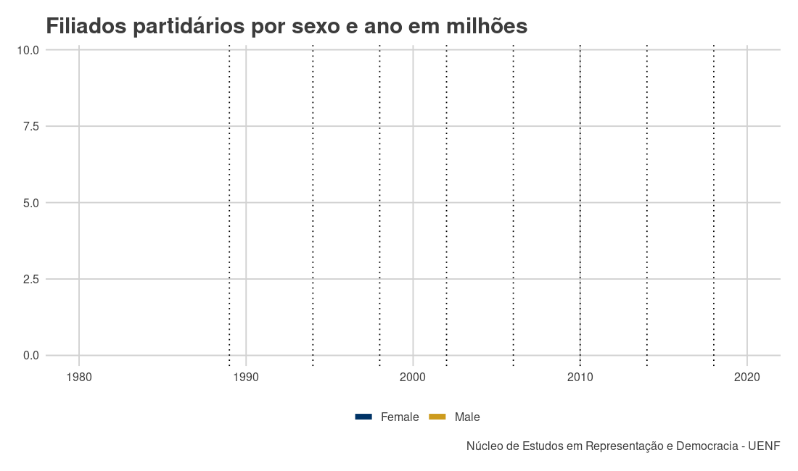
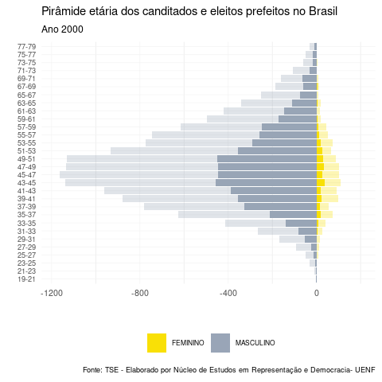
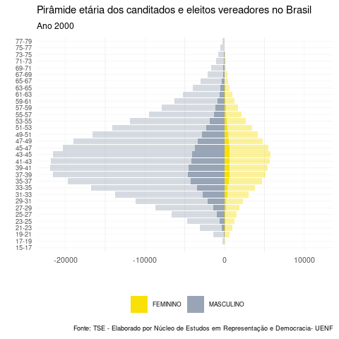
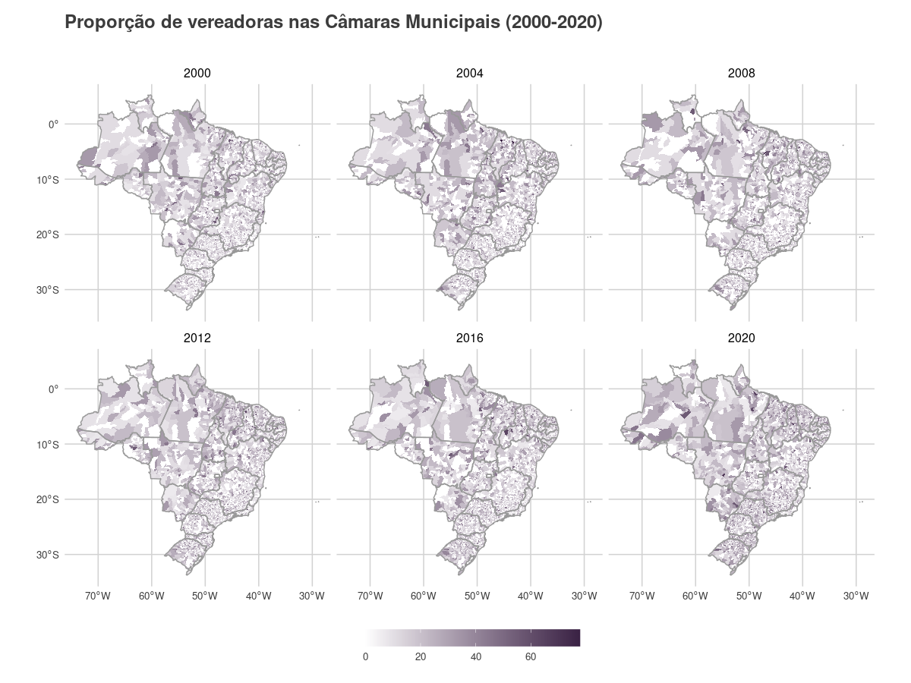
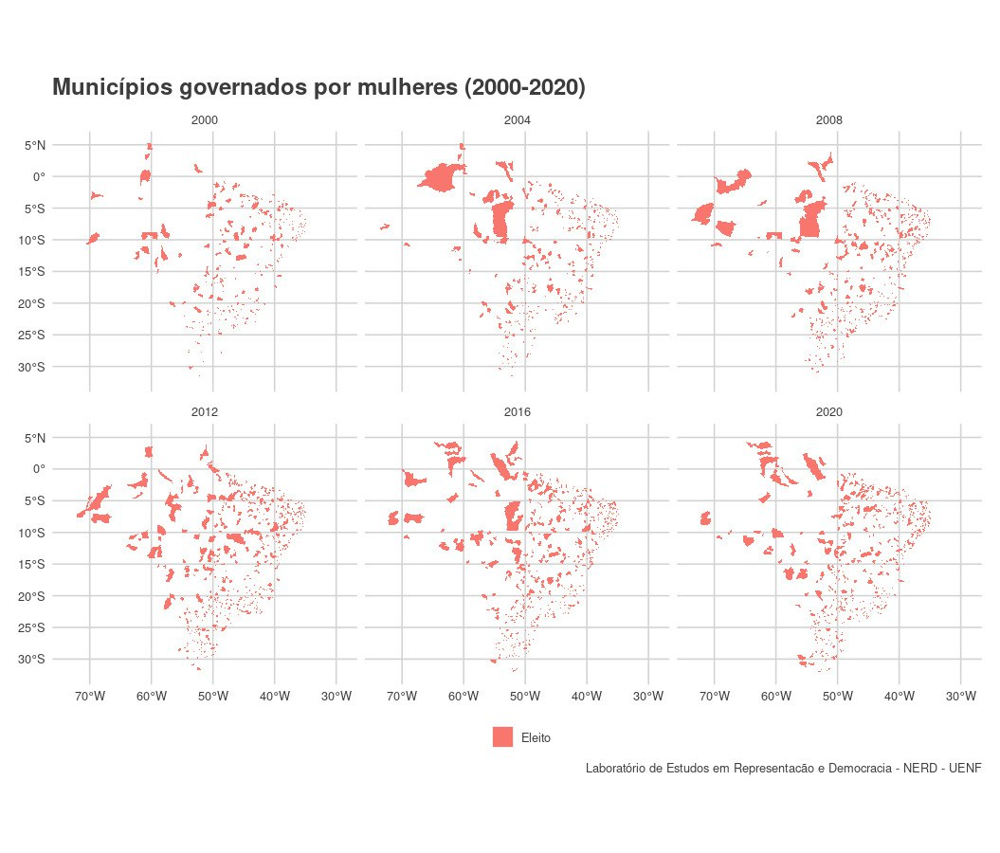
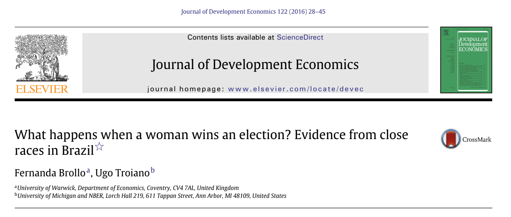
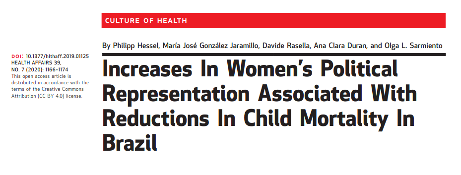

```{r setup, include=FALSE}

options(htmltools.dir.version = FALSE)

library(tidyverse)
library(ggthemes)

load("~/dados_eleicoes_tse/MULHERES/lapop_abcp.RData")

load("~/dados_eleicoes_tse/COMPETICAO_ELEITORAL/candidaturas_genero.Rda")

  

```


# Roteiro:

- Apresentar principais problemas de pesquisas do campo

- Investigar diferenças atitudinais das mulheres e homens no eleitorado como ideologia e preferencia por partidos  (LAPOP)

- Averiguar evolução do recrutamento partidário por gênero

- Analisar a evolução das candidaturas femininas nas eleições municipais

- Impacto das mulheres prefeitas eleitas sobre políticas públicas

---
# Alguns problemas de pesquisas típicos do campo:
  
  
- Questão teórica: Representacao descritiva x representacao substantiva

--

- Processo de inclusão das mulheres na arena eleitoral municipal

--

- Cotas e as propostas de reforma eleitoral  

--

- Financiamento de candidatas  

--

- Barreiras à atividade parlamentar (e jurídica)

--

- Resultados de políticas públicas


---
# Inclusão das mulheres


1) argumento pelo simbolismo de um
aumento no número de mulheres na política; 

2) argumento por justiça, por meio do qual é afirmado que não é justo
que, sendo as mulheres mais ou menos 50% da população,
os homens monopolizem as decisões políticas; 

3) argumento da diferença, que considera que as mulheres são diferentes dos homens, mais éticas e honestas, e que podem contribuir
para mudar a política; e 

4) argumento pela importância da experiência  de  vida,  visto  que  as  mulheres  tendem  a  ter experiências de vidas distintas dos homens e podem tornar o processo político mais representativo dos interesses e das perspectivas de setores sociais mais amplos.

SACCHET, Teresa. Representação política, representação de grupos e política de cotas: perspectivas e contendas feministas. Revista Estudos Feministas, v. 20, p. 399-431, 2012.

SAWER, Marian et al. Women and elections. Comparing democracies, v. 3, p. 202-223, 2010.
  
---
# Diferenças atitudinais(campo das idéias)

```{r message=FALSE, warning=FALSE, echo=FALSE, fig.width=18, fig.align='center', fig.height=12}


long_interesse <- lapop_abcp %>%
  filter(interesse <= 4) %>% 
  group_by(Mulher, Ano, interesse) %>% 
  summarise(n_interesse = n()) %>% 
  group_by(Mulher, Ano) %>% 
  mutate(n = sum(n_interesse, na.rm = T), 
         p = n_interesse/n, 
         erro = sqrt((p *(1 - p)/n)),
         perc = p *100,
         p_erro = erro * 100)


long_interesse %>% 
  mutate(Mulher = case_when(Mulher == 0 ~ "Homem", 
                            Mulher == 1 ~ "Mulher"), 
         interesse = case_when(interesse == 1 ~ "Muito", 
                          interesse == 2 ~ "Algo",
                          interesse == 3 ~ "Pouco",
                          interesse == 4 ~ "Nada")) %>% 
  ggplot(aes(x = as.numeric(Ano), y = perc, col = as_factor(interesse), fill = Mulher, linetype = Mulher))+
  geom_line(stat = "identity", size = 1.3)+
  geom_errorbar(aes(ymin = perc - p_erro, ymax = perc + p_erro), 
                position =  position_dodge(0.05), size = 1, width = 1.5)+
  scale_x_continuous(breaks = c(2006, 2008, 2010, 2012, 2014, 2016, 2018))+
  ggthemes::theme_fivethirtyeight()+
  labs(title = "Interesse por política e gênero",
       fill = "", 
       col = "", 
       y = "", 
       linetype = "")+
  scale_color_manual(values = c("#8caef9" , "#0640bc" , "#bd99cc", "#734488"))+
  scale_y_continuous(labels=function(x) paste0(x,"%"))+
  theme(title = element_text(size = 18),
        axis.title.y = element_text(size = 15),
        axis.text.y = element_text(size = 15),
        axis.text.x = element_text(size = 15),
        legend.text = element_text(size = 17),
        plot.caption = element_text(size = 12),
        panel.background = element_rect(fill = "white", colour = "white", color = "white"),
        plot.background = element_rect(fill = "white", colour = "white", color = "white"),
        legend.background=element_rect(fill="white"),
        legend.key = element_rect(fill = "white", color = "white"),
        strip.background=element_rect(fill="white", colour="white"))

```


---
# Ideologia por gênero (2006-2018)
```{r,echo=FALSE, fig.width=15, fig.height=10, message=FALSE}

ideologia_genero <- lapop_abcp %>%
   group_by(Ano, Mulher, Ideologia) %>%
   summarise(n_ideo = n()) %>%
   group_by(Ano, Mulher) %>%
   mutate(n = sum(n_ideo),
         perc = n_ideo/n*100,
         ideo = replace_na(Ideologia, "Sem ideologia"))
  
ideologia_genero %>%
  mutate(Mulher = case_when(Mulher == 0 ~ "Homem",
                              Mulher == 1 ~ "Mulher")) %>%
 ggplot(aes(x = as.numeric(Ano), y = perc, col = ideo))+
   geom_line(stat = "identity", size = 2.3)+
   geom_point(size = 4)+
   facet_grid(Mulher~.)+
   scale_x_continuous(breaks = c(2006, 2008, 2010, 2012, 2014, 2016, 2018))+
  ylim(0,50)+
  labs(x = "",
       caption = "Elaborado pelos autores com base no LAPOP 2006-2018",
       y = "Percentual",
       col = NULL,
       title = "")+
  scale_colour_manual(values = c( "goldenrod3", "#003366", "#d42424", "#c5c5c5"))+
  theme_fivethirtyeight()+
  theme(title = element_text(size = 20),
        axis.title.y = element_text(size = 16),
        axis.text.y = element_text(size = 16),
        axis.title.y.right = element_text(size = 18),
        axis.text.x = element_text(size = 16),
        legend.text = element_text(size = 18),
        plot.caption = element_text(size = 14),
        panel.background = element_rect(fill = "white", colour = "white", color = "white"),
        plot.background = element_rect(fill = "white", colour = "white", color = "white"),
        legend.background=element_rect(fill="white"),
        legend.key = element_rect(fill = "white", color = "white"),
        strip.background=element_rect(fill="white", colour="white"),
        strip.text = element_text(size = 20, colour = "black", angle = 90, face = "bold"))

```

---
# Simpatia partidária por gênero
```{r, echo=FALSE, fig.align='center', fig.height= 10, fig.width=15, message=FALSE, warning=FALSE }

simpatia_part_genero <- lapop_abcp %>%
  filter(vb10 != 988888, vb10 != 888888) %>%
  group_by(Ano, Mulher, vb10) %>%
  summarise(n_simpatia = n()) %>%
  group_by(Ano, Mulher) %>%
  mutate(n = sum(n_simpatia, na.rm = T),
         p = n_simpatia/n,
         erro = sqrt((p *(1 - p)/n)),
         perc = p *100,
         p_erro = erro * 100)


simpatia_part_genero %>%
  filter(vb10 == 1) %>%
   mutate(Mulher = case_when(Mulher == 0 ~ "Homem",
                            Mulher == 1 ~ "Mulher"),
         vb10 = case_when(vb10 == 1 ~ "Sim",
                          vb10 == 2 ~ "Não")) %>%
  ggplot(aes(x = as.numeric(Ano), y = perc, col = Mulher))+
  geom_line(stat = "identity", size = 2)+
  geom_point(size =4)+
  geom_errorbar(aes(ymin = perc - p_erro, ymax = perc + p_erro),
                 position = position_dodge(0.05), size = 1, width = 0.5)+
  scale_x_continuous(breaks = c(2006, 2008, 2010, 2012, 2014, 2016, 2018))+
  ylim(0,50)+
  labs(x = "",
       caption = "Elaborado pelos autores com base no LAPOP 2006-2018",
       y = "Percentual",
       col = NULL,
       title = "")+
  scale_color_manual(values = c("goldenrod3", "#003366"))+
  theme_fivethirtyeight()+
   theme(title = element_text(size = 14),
        axis.title.y = element_text(size = 16),
        axis.text.y = element_text(size = 16),
        axis.title.y.right = element_text(size = 18),
        axis.text.x = element_text(size = 16),
        legend.text = element_text(size = 18),
        plot.caption = element_text(size = 14),
        panel.background = element_rect(fill = "white", colour = "white", color = "white"),
        plot.background = element_rect(fill = "white", colour = "white", color = "white"),
        legend.background=element_rect(fill="white"),
        legend.key = element_rect(fill = "white", color = "white"),
        strip.background=element_rect(fill="white", colour="white"),
        strip.text = element_text(size = 20, colour = "black", angle = 90, face = "bold"))

```

---
# Atidudes sobre liderança e aborto

```{r, echo=FALSE}

knitr:: 

```


---
### Esquema Norris
```{r, echo = FALSE,out.width= "40%" }

knitr:: 

```
NORRIS, Pippa; LOVENDUSKI, Joni. Political recruitment: Gender, race and class in the British Parliament. Cambridge University Press, 1995.

---
# Elegíveis

```{r, echo = FALSE}

knitr:: 

```


---
# Mecanismos institucionais 

--
Evolução das cotas de gênero nas eleições proporcionais


- Lei de 1995 - reserva de vagas na nominata

- Lei de 2009 - obrigatoriedade de candidaturas

- ADI 5617 - 2018 - Financiamento de campanhas para mulheres 


---


```{r,  echo=FALSE, fig.width=14, fig.height=8, fig.align='center'}

candidaturas_genero %>% 
  filter(DS_GENERO == "FEMININO",
         eleito == 1) %>% 
  mutate(cargo = ifelse(CD_CARGO == 11, "Prefeitas", "Vereadoras")) %>% 
  
ggplot() +
  aes(x= ANO_ELEICAO, y = total_candidaturas, col = as_factor(cargo), group =as_factor(cargo))+
  geom_line(stat = "identity", size = 2.8)+
  theme_fivethirtyeight()+
   scale_color_manual(values = c("#003366", "goldenrod3") )+
  labs(title = "Total de eleitas por cargo nas eleições municipais (2000-2020)",
       col = "",
        y = "")+
  theme(title = element_text(size = 14),
        axis.title.y = element_text(size = 16),
        axis.text.y = element_text(size = 16),
        axis.title.y.right = element_text(size = 18),
        axis.text.x = element_text(size = 16),
        legend.text = element_text(size = 18),
        plot.caption = element_text(size = 14),
        panel.background = element_rect(fill = "white", colour = "white", color = "white"),
        plot.background = element_rect(fill = "white", colour = "white", color = "white"),
        legend.background=element_rect(fill="white"),
        legend.key = element_rect(fill = "white", color = "white"),
        strip.background=element_rect(fill="white", colour="white"),
        strip.text = element_text(size = 20, colour = "black", angle = 90, face = "bold"))+
  geom_vline(xintercept = c(2009, 2018))+
  scale_x_continuous(breaks = c(2000, 2004, 2008, 2012, 2016, 2020))


```


---

```{r,  echo=FALSE, fig.width=14, fig.align='center', fig.height=8}

candidaturas_genero %>% 
  filter(CD_CARGO == 13,
         eleito == 1) %>% 
  
ggplot() +
  aes(x= as_factor(ANO_ELEICAO), y = total_candidaturas, col = DS_GENERO, group = DS_GENERO)+
  geom_line(stat = "identity", size = 2.8)+
  theme_fivethirtyeight()+
   scale_color_manual(values = c("#003366", "goldenrod3") )+
  labs(title = "Total de candidaturas por gênero nas eleições proporcionais municipais (2000-2020)",
       col = "",
        y = "")+
  theme(title = element_text(size = 14),
        axis.title.y = element_text(size = 16),
        axis.text.y = element_text(size = 16),
        axis.title.y.right = element_text(size = 18),
        axis.text.x = element_text(size = 16),
        legend.text = element_text(size = 18),
        plot.caption = element_text(size = 14),
        panel.background = element_rect(fill = "white", colour = "white", color = "white"),
        plot.background = element_rect(fill = "white", colour = "white", color = "white"),
        legend.background=element_rect(fill="white"),
        legend.key = element_rect(fill = "white", color = "white"),
        strip.background=element_rect(fill="white", colour="white"),
        strip.text = element_text(size = 20, colour = "black", angle = 90, face = "bold"))


```
 
 

---


```{r, echo=FALSE, fig.width=14, fig.align='center', fig.height=8}


taxa_sucesso_wide <- candidaturas_genero %>% 
  filter(eleito ==1) %>% 
  select(-total_eleitos, -total_candidaturas, -eleito, -total) %>% 
  pivot_wider(values_from = taxa_sucesso_genero, names_from = CD_CARGO)


taxa_sucesso_wide %>% 
  
  ggplot()+
  aes(x = as_factor(ANO_ELEICAO),  
   col = DS_GENERO, group = DS_GENERO)+
  geom_line( aes(y= `11`), stat = "identity", size = 2.8 )+
  geom_line( aes(y = `13`), stat = "identity", size = 2.8, linetype = "dashed")+
  ylim(0, 40)+
  theme_fivethirtyeight()+
  labs(title = "Taxa de sucesso por gênero nas eleições municipais (2000-2020)",
       col = "",
       y = "")+
  
  scale_color_manual(values = c("#003366", "goldenrod3") )+
  theme(title = element_text(size = 20),
        axis.title.y = element_text(size = 16),
        axis.text.y = element_text(size = 16),
        axis.title.y.right = element_text(size = 18),
        axis.text.x = element_text(size = 16),
        legend.text = element_text(size = 18),
        plot.caption = element_text(size = 14),
        panel.background = element_rect(fill = "white", colour = "white", color = "white"),
        plot.background = element_rect(fill = "white", colour = "white", color = "white"),
        legend.background=element_rect(fill="white"),
        legend.key = element_rect(fill = "white", color = "white"),
        strip.background=element_rect(fill="white", colour="white"),
        strip.text = element_text(size = 20, colour = "black", angle = 90, face = "bold"))


```


---

```{r, echo=FALSE, out.width= "70%", fig.align='center' }


```
---


```{r, echo=FALSE, out.width= "70%", fig.align='center'}


```


---

```{r, echo=FALSE}



```

---


```{r, echo=FALSE, out.width= "100%" }



```


---
# Faz diferença ser governado por mulheres?

- Corrupção 
- Contratações temporárias em anos eleitorais

```{r, echo= FALSE, out.height="20%"}

knitr:: 

```

---
# Faz diferença ser governado por mulheres?

- Mortalidade infantil

```{r, echo= FALSE, out.height="20%"}

knitr:: 

```


---
# Faz diferença ser governado por mulheres?

 ## Agenda aberta:
 
- Vacinação
- Assistência médica e Social
- Reações à pandemia


